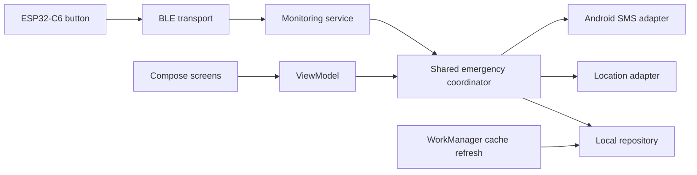

# SafeSignal

An Android personal-safety prototype with a physical Bluetooth emergency button. Three quick presses on a Seeed XIAO ESP32-C6 trigger an emergency SMS to saved contacts, followed by a location link. The phone also has an on-screen SOS button.

Built with **Kotlin, Jetpack Compose, Android BLE, foreground services, WorkManager and NimBLE C++ firmware**. Optional Firebase accounts and private contact invitations are implemented; app-to-app notifications and audio are on hold.

## What works today

- Three physical presses within two seconds trigger an alert. Extra presses during the active incident do not resend it.
- An initial SMS includes the latest cached location when available. A current-location request then sends a second SMS with a Maps link.
- Contact creation, editing and confirmed removal, with Android's phone-contact picker or manual number entry; PIN-protected cancellation notifies the original incident recipients.
- BLE scanning, explicit device selection, notification subscription and reconnect attempts with backoff.
- User-started background monitoring with an Android foreground-service notification.
- Cached-location refresh: approximately 15 minutes in Armed mode, two hours in Low Power, none in Off. These settings are independent of BLE monitoring.
- Optional email/password accounts, verification, reset emails and accepted private invitations.
- System-bar-safe navigation and immediate invitation-code feedback; see the [UX review](docs/UX_REVIEW.md).

**Status:** ongoing prototype. The physical button → BLE → SMS flow and two-account invitations have been tested manually on a Xiaomi Redmi Note 15 running Android 15. Process-death recovery, authenticated BLE pairing and broader device testing remain open. SMS submission is not proof of delivery.

## Architecture



The Activity handles platform permissions and connects state to the UI. Screens receive values and callbacks; they do not operate Bluetooth hardware. One application-scoped coordinator owns the SOS/location request across screen recreation and background button events. Repository interfaces allow unit tests to substitute SMS, location and storage.

A single Android module keeps this project easy to navigate. Separate domain, data, platform and UI packages provide boundaries without introducing a dependency-injection framework or a module for every feature. See [architecture and tradeoffs](docs/ARCHITECTURE.md).

| Directory | Purpose |
| --- | --- |
| `app/src/main/.../domain/` | Incident logic, press decoding, repository contracts |
| `app/src/main/.../data/` | Local persistence and Firebase adapters |
| `app/src/main/.../platform/` | BLE, SMS, location and background services |
| `app/src/main/.../ui/` | Compose screens and ViewModels |
| `app/src/test/` | Unit and notification-to-SMS pipeline tests using fakes |
| `app/src/androidTest/` | Account UI instrumentation tests |
| `firmware/EmergencyButton/` | ESP32-C6 firmware |
| `firebase-tests/` | Firestore authorization tests against a local emulator |
| `.github/workflows/` | Android build/lint/tests and Firestore rule checks |

## Build locally

Use Android Studio, **JDK 21**, Android SDK platform **36.1** and Build Tools **36.0.0**. The Gradle wrapper pins Gradle 9.4.1; dependencies are declared in the version catalog. Minimum Android version is **12 / API 31**; target SDK is 36.

Open this folder in Android Studio and let it create `local.properties` for your SDK path. Firebase configuration and hardware are **not required to build or run unit tests**.

```bash
# macOS / Linux
sh gradlew :app:assembleDebug :app:testDebugUnitTest :app:lintDebug
```

```powershell
# Windows — JAVA_HOME should point to JDK 21 (Android Studio's bundled JDK works).
.\gradlew.bat :app:assembleDebug :app:testDebugUnitTest :app:lintDebug
```

Install `app/build/outputs/apk/debug/app-debug.apk` or use Android Studio Run. Hardware SMS testing requires an SMS-capable phone, a SIM plan and the requested permissions. Coordinate tests with the recipients first.

### Hardware

Wire a normally-open button between **D2 and GND** on the **Seeed XIAO ESP32-C6**. Upload `firmware/EmergencyButton/EmergencyButton.ino` using ESP32 core **3.3.10** and **NimBLE-Arduino 2.5.0**. The tested Arduino CLI version is 1.5.1.

```bash
arduino-cli compile --fqbn esp32:esp32:XIAO_ESP32C6 firmware/EmergencyButton
```

The firmware debounces the switch and sends numbered press notifications. The phone counts presses and sends SMS. See [wiring, protocol and device tests](docs/BLE_TESTING.md).

### Optional Firebase setup

The public source contains no Firebase project configuration. Follow [account setup](docs/FIREBASE_SETUP.md), add your own `app/google-services.json`, then follow [app-contact setup](docs/APP_CONTACTS_SETUP.md). Without that file, account operations are unavailable while the SMS/BLE features still build.

## Verification

Run local Firestore rule tests with Node.js 24, pnpm 11.19.0 and JDK 21:

```bash
cd firebase-tests
pnpm install --frozen-lockfile
pnpm test
```

Tests use the `demo-safesignal` emulator project and never publish rules. The [testing record](docs/TESTING.md) separates automated checks, user-confirmed device tests and unverified scenarios. CI checks the Android build without Firebase configuration and runs the rule tests; it does not send SMS, access production Firebase or flash hardware.

## Current limits and next work

- Active incident state and recipients survive reopening; interrupted SMS/location work is not automatically recovered after process death.
- Monitoring must be restarted after reboot or force-stop. Xiaomi and other vendors' background restrictions need more testing.
- Known-address reconnection is not authenticated pairing. Companion-device integration and bonding remain planned.
- Repeated five-minute emergency location messages, delivery acknowledgements and audio are not implemented.
- Local settings belong to the phone installation. Account deletion, retention controls and a fuller privacy review remain release work.

The [backlog](BACKLOG.md) records feature plans. [Review notes](docs/ENGINEERING_REVIEW.md) explain the current engineering strengths and limitations. [Publishing notes](docs/GITHUB.md) describe the repository setup and suggested CV presentation.

No open-source licence has been selected yet.
